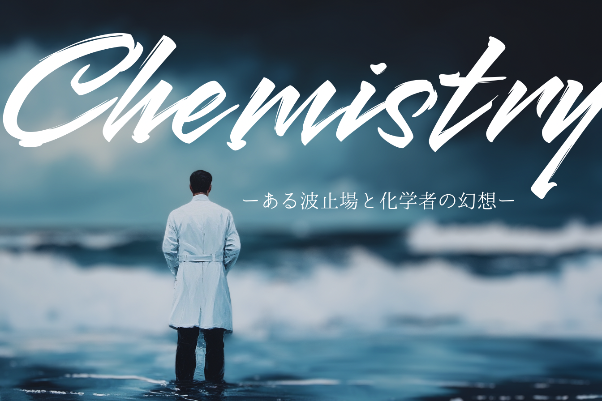
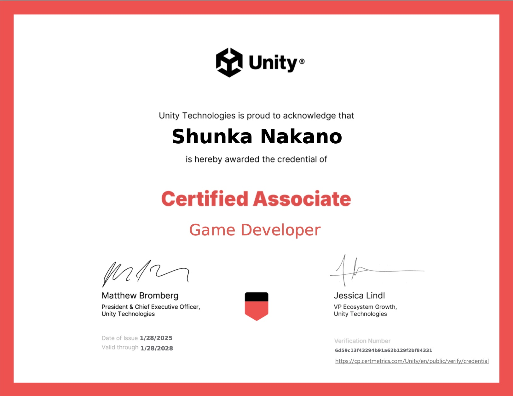
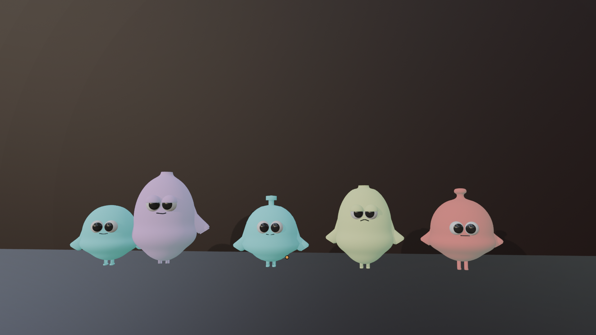

# Chemistry - ある波止場と化学者の幻想 -
  
## はじめに
このプロジェクトは、私が個人で開発しているVRゲーム「**Chemistry - ある波止場と化学者の幻想 -**」の詳細を紹介するリポジトリです。ゲームの概要、技術スタック、開発環境、利用方法、そして今後の改善予定についてまとめています。

## 自己紹介
私は教育学部の2回生　中野春花です。特にVR空間でのスキル習得に興味があり、今後はVRを活用した社員教育などのプロジェクトに携わることを目指しています。

### スキルセット
- **プログラミング言語**: HTML/CSS, JavaScript, jQuery, PHP（最近はC#が中心なので少しブランクあり）C#　　　
- **ゲームエンジン**: Unity
- **ツール**: Blender（3Dモデリング）, Substance Painter　　　
- **その他**: Git（勉強中）

### 資格
unity認定アソシエイト:ゲーム開発者

## コンセプト
このゲームは、中学3年生の理科「中和反応」の学習を題材にしたスキル習得型のゲームです。理科の授業では「中和反応」の学習から、可視的な物質から見えないイオンの世界に移行するため、生徒がイメージしにくく、つまずくことが多いと感じました。この問題を解決するために、学習内容を楽しく学べるようにストーリー仕立ての脱出ゲームとして開発しました。勉強が苦手な生徒でも興味を持ちやすく、学習効果を高めることを目指しています。

## ゲーム概要
- **ジャンル**: 脱出ゲーム
- **プレイ人数**: 1人
- **目的**: プレイヤーは無人島に取り残され、フィールドを探索しながらキャラクター化したイオンを収集します。実際の化学反応に基づいた反応を引き起こし、脱出を目指します。
- **主要メカニクス**:
  - マップ探索
  - アイテム収集
  - ストーリー進行

## デモ動画
上がダイジェスト動画、下が完全版動画になります。

## 開発環境

### ソフトウェア
- **OS**: Windows 10 / macOS
- **ゲームエンジン**: Unity 2023.x
  
### 開発環境
- **エディタ**: Visual Studio 2022
- **バージョン管理**: Git, GitHub

## 利用方法
このゲームでは、コントローラーの移動操作のみを使用します。ボタン操作は必要ありません。

### インストール方法
1. **SideQuest**を使用して、以下のAPKファイルを実機にインストールしてください。
2. **APKファイルのダウンロード**: [APKファイルリンク](https://your-apk-file-link.com)
3. インストール後、VRデバイスを接続してゲームを起動してください。

## 制作したスクリプト
作成したスクリプトとその解説です。
-  [IonController.cs](IonController.cs)
-  [IonCollector.cs](IonCollector.cs)
-  [ChemistryReaction.cs](ChemistryReaction.cs)
-  [IntroSequenceManager.cs](IntroSequenceManager.cs)
-  [IONAreaTrigger.cs](IONAreaTrigger.cs)

## 自作アセット
イオンキャラクターは、化学的な知識に基づき自作しました。陰イオンは眠たそうなデザインにし、イオンの動きは最外殻電子数に合わせた挙動にしています。これらのデザインは、化学の理解を深めることを意識しています。

また、背景制作も得意なので、今後は背景アセットも自作で制作し、別のゲーム内で使用したいと考えています。

  

  

## 改善予定の機能
今後、以下の改善を予定しています：
- **ハンドトラッキングへの変更**  
  実際はコントローラーを握っている状態ですが、VR上では手が開いているように表示されており、この違いが没入感を欠けさせていると感じます。
  これを改善するため、ハンドトラッキング機能を追加予定です。

- **イオンを手から離せるようにする**  
  プレイヤーへ明確に指示することが多いので今回はイオンの収集は一度吸収したものは離せないようにしてありますが、プレイヤーの自由度が高まるように改善が完了すれば吸収したイオンを戻せるようにするつもりです。

- **イオンの種類に基づいた反応管理**  
  いくつかの化学反応を実装しましたが、誤ったイオンを使用した際に反応しないように、イオンの種類をより厳密に管理し、反応を適切に制御できるように改善予定です。
  制作中に複雑化し反応機能に不具合が生じたため、今回は優先順位をつけてまずは完成を目指しました。

- **トリガーボタンでしゃがむ**  
  低いイオンも収集できるようにします（現在実装中）

