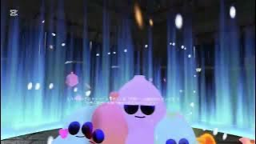
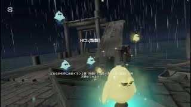

# Chemistry - ある波止場と化学者の幻想 -
  
## はじめに
このプロジェクトは、私が個人で開発しているVRゲーム「**Chemistry - ある波止場と化学者の幻想 -**」の詳細を紹介するリポジトリです。ゲームの概要、技術スタック、開発環境、利用方法、そして今後の改善予定についてまとめています。

## 自己紹介
私は明星大学教育学部通信課程　教育学科数学専攻　２学年/VRプロフェッショナルアカデミー生の中野春花です。特にVR空間でのスキル習得に興味があり、今後はVRを活用した社員教育などのプロジェクトに携わることを目指しています。

### スキルセット
- **プログラミング言語**: HTML/CSS, JavaScript, jQuery, PHP（最近はC#が中心なので少しブランクあり）C#　　　
- **ゲームエンジン**: Unity
- **ツール**: Blender（3Dモデリング）, Substance Painter　　　
- **その他**: Git（勉強中）　　　　　　
　　　　　　　
### 資格　　　　　　
unity認定アソシエイト:ゲーム開発者

## コンセプト
このゲームは、中学3年生の理科「中和反応」の学習を題材にしたスキル習得型のゲームです。理科の授業では「中和反応」の学習から、可視的な物質から見えないイオンの世界に移行するため、生徒がイメージしにくく、つまずくことが多いと感じました。この問題を解決するために、学習内容を楽しく学べるようにストーリー仕立ての脱出ゲームとして開発しました。勉強が苦手な生徒でも興味を持ちやすく、学習効果を高めることを目指しています。

## ゲーム概要
- **ジャンル**: 脱出ゲーム
- **プレイ人数**: 1人
- **目的**: プレイヤーは無人島に取り残され、フィールドを探索しながらキャラクター化したイオンを収集します。実際の化学反応に基づいた反応を引き起こし、脱出を目指します。
- **主要メカニクス**:
  - マップ探索
  - アイテム収集
  - ストーリー進行

## デモ動画
上がダイジェスト動画、下が完全版動画になります。　　　　　　

## 使用した技術

### 1. ゲームエンジン
- **Unity**: ゲームエンジンとして使用。2Dおよび3Dコンテンツ制作、ゲームのロジックやシーン管理など。
  
### 2. スクリプト言語
- **C#**: ゲームのロジックやインタラクションを記述。

### 3. UIシステム
- **Unity UI**: `Text` コンポーネントを使用して、メッセージ表示機能を実装。

### 4. プレイヤー操作
- **Collider**: トリガー領域を設定し、プレイヤーがエリアに入るとメッセージを表示。
  
### 5. アニメーションとコルーチン
- **Coroutine**: 時間経過による非同期処理を実現。メッセージを指定した時間だけ表示。

### 6. その他
- **Unityタグシステム**: プレイヤーオブジェクトの識別に使用。
- **Unity Inspector**: スクリプトのパラメータ（表示時間やメッセージ）の調整。
- **blender**: アセットの制作。

## 開発環境

### ソフトウェア
- **OS**: Windows 10 / macOS
- **ゲームエンジン**: Unity 2023.x
  
### 開発環境
- **エディタ**: Visual Studio 2022
- **バージョン管理**: Git, GitHub

## 利用方法
このゲームでは、コントローラーの移動操作のみを使用します。ボタン操作は必要ありません。

### インストール方法
1. **SideQuest**を使用して、以下のAPKファイルを実機にインストールしてください。
2. **APKファイルのダウンロード**: [APKファイルリンク](https://drive.google.com/file/d/1nAQgtlw3C8k0ay3gY3nEbw88cbqTZIv4/view?usp=share_link)
3. インストール後、VRデバイスを接続してゲームを起動してください。

## 制作したスクリプト
作成したスクリプトとその解説です。
-  [IonController.cs](IonController.cs)
吸収されるとオブジェクトが手に追従し、吸収時にエフェクトが発生します。またisAbsorbedフラグを用いて吸収状態を管理し、吸収された場合のみオブジェクトの位置を固定し、手に追従させるシンプルなロジックを組みました。そして吸収時にはエフェクトをインスタンス化し、一定時間後に削除することで、リアルタイムでエフェクトを表示しました。

-  [IonCollector.cs](IonCollector.cs)
「Ion」タグが付けられたオブジェクト（イオン）がコライダーに入ると、IonControllerを取得し、そのイオンが吸収されていなければ収集処理を行います。
収集時にはエフェクトや音声を再生し、さらにUIにメッセージを表示することで、プレイヤーへのフィードバックが直感的で明確になるようにしました。
handIonsというディクショナリを使用して、各手に収集されたイオンを個別に管理しています。これにより、収集したイオンを手ごとに整理し、上限（maxIonsPerHand）を守ることができます。GetNext AvailableHandメゾットで各手が収集できる空きスペースを確認し、空いている手を返します。
手が満杯ならnullを返します。またChemistryReactionスクリプトから現在の反応回数を取得し、反応回数が1になったら、手のイオンリスト（handIons）
をクリアします。
-  [ChemistryReaction.cs](ChemistryReaction.cs)
プレイヤーが手に吸収したイオンを使い、反応を引き起こすシステムです。反応が進行するごとにエフェクト、音声、UIの変更が行われ、一定の条件を満たすとシーン遷移が発生します。AreIonsOnBothHands()メゾットによる両手にイオンが吸収されているか、AreIonsTouching()メゾットによる両手が接触しているかの双方を満たした場合反応を開始します。手の距離は0.5m以下であれば接触していると見なします。InvokeRepeatingでCheckIonsAndHandsメソッドを定期的に呼び出し、イオンの状態や手の接触状態を常にチェックしています。
-  [IntroSequenceManager.cs](IntroSequenceManager.cs)
プレイヤーの視点を操作し、音声を再生してUIにメッセージを表示しながら、ストーリーの展開を示す一連のアニメーションとイベントを順番に実行します。
FadeIn() メソッドで、シーンが暗転してから明るくなる演出を行ったり、Blink() メソッドで、瞬きする効果を演出します。視覚的な効果として、CanvasのAlpha値を操作して目を開けたり閉じたりします。また、WakeUpSequence() メソッドで、プレイヤーの視点（カメラ）を上に動かして、起き上がるアニメーションを行います。さらにプレイヤーの操作をシーケンス中は無効化し、シーケンスが進行している間の操作を制限します。

-  [IONAreaTrigger.cs](IONAreaTrigger.cs)
プレイヤーが特定のトリガー領域に入ったときにUIテキストを表示し、一定時間後に非表示にする仕組みです。メッセージを表示する処理はIEnumeratorを使ったコルーチンで実行されており、コルーチンによって、指定された時間待機してからメッセージを非表示にします。

## 自作アセット
イオンキャラクターは、化学的な知識に基づき自作しました。陰イオンは眠たそうなデザインにし、イオンの動きは最外殻電子数に合わせた挙動にしています。これらのデザインは、化学の理解を深めることを意識しています。

また、背景制作も得意なので、今後は背景アセットも自作で制作し、別のゲーム内で使用したいと考えています。

  

  

## 改善予定の機能
今後、以下の改善を予定しています。
- **ハンドトラッキングへの変更**  
  実際はコントローラーを握っている状態ですが、VR上では手が開いているように表示されており、この違いが没入感を欠けさせている原因だと感じます。
  これを改善するため、ハンドトラッキング機能を追加予定です。

- **イオンを手から離せるようにする**  
  プレイヤーへ明確に指示することが多いので今回はイオンの収集は一度吸収したものは離せないようにしてありますが、プレイヤーの自由度が高まるように改善が完了すれば吸収したイオンを戻せるようにするつもりです。

- **イオンの種類に基づいた反応管理**  
  いくつかの化学反応を実装しましたが、誤ったイオンを使用した際に反応しないように、イオンの種類をより厳密に管理し、反応を適切に制御できるように改善予定です。
  制作中に複雑化し反応機能に不具合が生じたため、今回は優先順位をつけてまずは完成を目指しました。

- **トリガーボタンでしゃがむ**  
  低いイオンも収集できるようにします（現在実装中）

